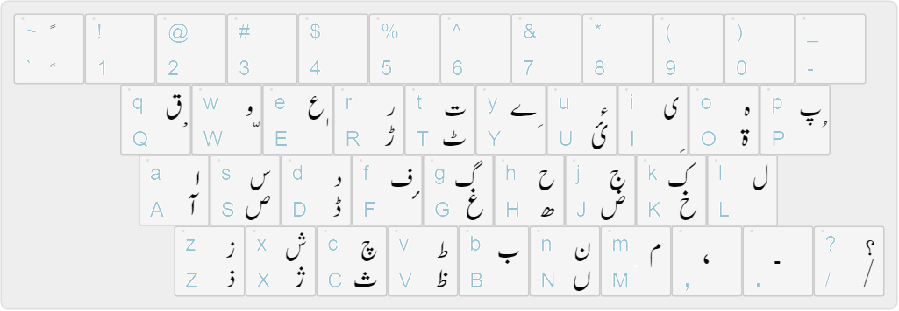

# UrduNize Text Box using Urdu Phonetic Keyboard
A jQuery code for typing in Urdu using an English keyboard. <BR>
<BR>
This is newer version of HTML/JS based Urdu Text Box that allows to type Urdu using JavaScript.<BR>
Older version of Urdu Text Box that is available at (https://www.ajsoftpk.com/urdutextbox/urdutextbox-for-asp-php-jsp.html) is replaced by this one.<BR>
This is a phonetic open-source mobile enabled jQuery plugin which enables typing in Urdu using an English keyboard.<br/>

## Instructions to use
- Download the file `urdunize.min.js`
- Place it in your assets and include it with`<script src="path/to/urdunize.min.js"></script>` after including latest version of jQuery
- Set Urdu input for the input field or textarea with an id e.g.
  ```javascript
   connectKeyboard("#u");
  ```

For more details on how to use this Urdu Component contact urdujini@gmail.com<br><br>

The keyboard mapping is given in the file urdu_phonetic_keyboard.png <br/>


A [demo can be seen here](http://www.ajsoftpk.com/naseem_amjad/urdu/online-urdu-keyboard/) as well as on [www.urdujini.com](http://www.urdujini.com/urdu-text-box/)
<br>
This Urdu Text Box can be used by Software Programmers / Web Developers to add Urdu editing functionality on their websites.

<br><br>
Note: This Urdu Textbox was developed for https://www.github.com/naseem1amjad/Php-Urdu-Text-on-Product-Designer/ available online.